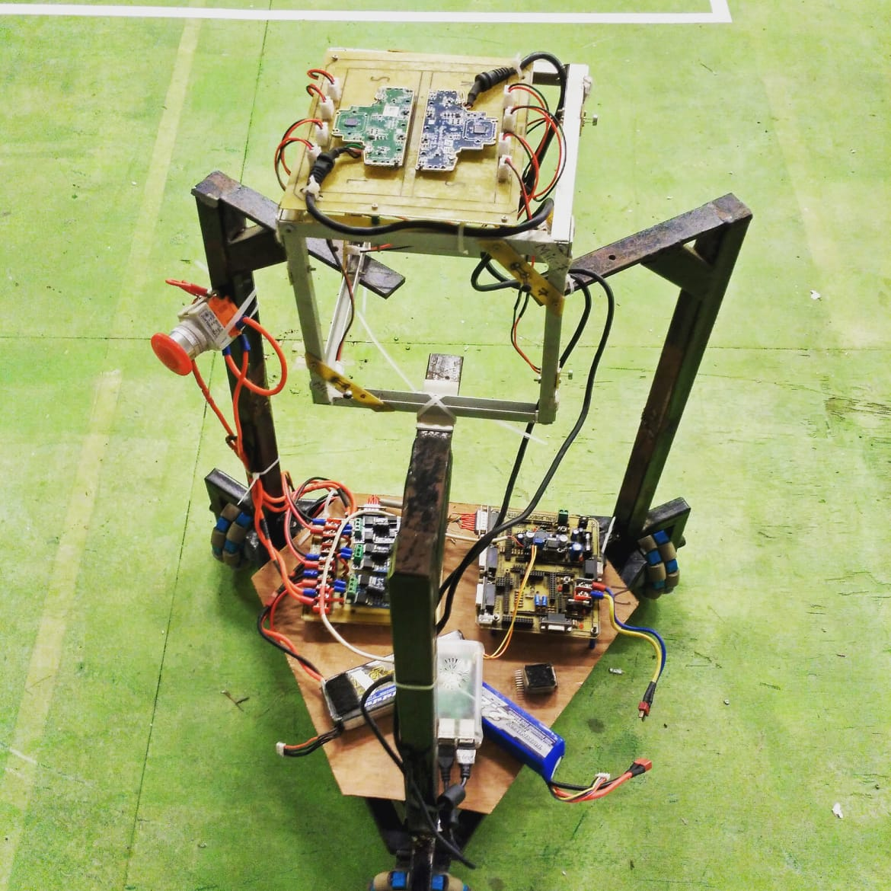

# Sound Source Localization Robot — Hardware

Hardware design files and firmware for a **mobile robot** used in **cubical microphone-array** sound-source localization. The platform combines a **three omni-wheel holonomic base** with an **eight-channel** mic harness routed through custom **KiCad** PCBs. Signal processing (GCC-PHAT, grid search, real-time demos, etc.) lives in the companion software repository.

  

  <a href="https://github.com/subashtimilsina/Sound-Source-Localization"><b>Software &amp; algorithms (SSL)</b></a>
  &nbsp;·&nbsp;
  <a href="http://idl.iscram.org/files/abhishkhanal/2020/2293_AbhishKhanal_etal2020.pdf"><b>ISCRAM 2020 paper (PDF)</b></a>

---

## Table of contents

- [System overview](#system-overview)
- [Mechanical construction](#mechanical-construction)
- [Electronics (PCBs)](#electronics-pcbs)
- [Embedded software (robot base)](#embedded-software-robot-base)
- [Assembly & integration](#assembly--integration)
- [Repository layout](#repository-layout)
- [License](#license)

---

## System overview

The robot was built to support **3D sound-source localization** using a **cubical array**: one microphone channel is associated with each **vertex** of a rigid cube, so delays between channels carry direction-of-arrival information. The **acquisition side** (USB audio interfaces, streaming, and localization code) is described in the [**Sound-Source-Localization**](https://github.com/subashtimilsina/Sound-Source-Localization) repo; **this** repository holds:

1. **Per-channel breakout boards** for cabling from each mic location.  
2. **Controller / array interconnect** PCBs that bundle **eight** mic lines toward the digitizer stack.  
3. **AVR firmware** for the **three omni-wheel** mobile base (holonomic drive).

Experimental context and notation are given in the [**ISCRAM 2020**](http://idl.iscram.org/files/abhishkhanal/2020/2293_AbhishKhanal_etal2020.pdf) publication linked above.

---

## Mechanical construction

1. **Holonomic base**  
   The robot stands on **three omni wheels** arranged for **omnidirectional** motion. Each wheel is driven by a DC motor with encoder/driver electronics (exact brackets and chassis cad are not stored in this repo; use the photograph and the ISCRAM paper as a reference for proportions and wiring clearance).

2. **Cubical microphone frame**  
   A rigid **cube** (or cubic frame) mounts above the base. **Eight** microphone capsules are placed at the **corners** of the cube so that pairwise time differences match the geometry used in the software (GCC-PHAT / grid search over candidate directions).

3. **Cable routing**  
   From each vertex, a short harness runs to a **local breakout** (see `Individual array/`), then longer runs converge on the **Mic_Array** controller board mounted near the compute stack. Keep **pair lengths symmetric** where possible and **avoid** running mic wires parallel to motor leads without shielding to reduce EMI.

4. **Stack**  
   The upper tray typically carries **USB audio** devices (multi-channel), power distribution, and the small-form PC or embedded computer used in the software repo’s notebooks and real-time scripts.

---

## Electronics (PCBs)

All boards were designed in **KiCad** (legacy `.sch` / `.kicad_pcb` + cache libs). For fabrication, open the `.kicad_pcb` in a current KiCad release, run DRC, and export **Gerbers**; SVGs in each folder are convenient for documentation and quick visual checks.

### `Individual array/` — single-channel adapter

| Artifact | Purpose |
|----------|---------|
| `Individual_mic.sch` / `Individual_mic.kicad_pcb` | One microphone **MIC** footprint wired to a **2-pin header** and a **JST EH**-style **2-pin** cable footprint (`JST_CONN`) for removable harness segments. |

Use one small circuit board **per microphone site** (or per edge entry point, depending on your mechanical layout) so cube wiring can be unplugged for service.

### `Array_Ckt/` and `Controller_Mic/` — eight-channel routing

| Artifact | Purpose |
|----------|---------|
| `Mic_Array.sch` / `Mic_Array.kicad_pcb` | Consolidates **eight** microphone channels: connectors are labeled **Mic1–Mic4** in **two** symmetric groups (covering all **eight** physical channels—see schematic nets **MicN** vs **MicN_chip**). Each channel uses **two** `CONN_01X02` headers: one faces the **harness/array** side, one faces the **digitizer / preamp** side. |
| `Mic_Array-brd.svg`, `Mic_Array-B.Cu.svg`, `drawing.svg` | Board artwork and copper preview for assembly notes. |

`Array_Ckt/` and `Controller_Mic/` are two KiCad project folders; compare Gerber outlines if you only need **one** physical board revision for your build.

---

## Embedded software (robot base)

Folder: **`3_Omni_Base/`**

| Item | Description |
|------|-------------|
| **`3_Omni_Base.atsln`**, **`3_Omni_Base/*.cppproj`** | **Microchip Studio** (Atmel Studio) solution targeting an **AVR** device (16 MHz `F_CPU` in `headers.h`). |
| **`main.cpp`** | Initializes a **`Wheel`** controller and runs a control loop: read command data, **compute wheel speeds**, update PWM to three motors. |
| **`Wheel.cpp` / `Wheel.h`** | **Holonomic** mixing: **3×3 coupling matrix** maps robot **(vx, vy, ω)**-style commands to **three** wheel velocities; **`Motor`** objects abstract per-wheel drive; **`get_joystick_data()`** reads **UART** packets (`rcvdata[]`), derives **azimuth** / **elevation** in `preprocess_data()`, and sets **`velocity_robot[]`** before **`calculate_wheel_velocity()`** and **`update_wheel_velocity()`**. |
| **`uart.cpp` / `Motor.cpp`** | Low-level serial I/O and motor timing (`MAX_RPM` defined in `Wheel.h`). |
| **`Debug/*.hex`** | Built firmware images (verify target MCU and fuse bits before flashing). |

**Typical workflow:** open the solution in Microchip Studio, select the **correct AVR** part and programmer, **build**, then **flash** the hex to the base microcontroller. Confirm wheel rotation signs match your mechanical mounting before driving under joystick control.

---

## Assembly & integration

1. **Fabricate** `Individual_mic` and `Mic_Array` PCBs; populate headers and JST (or substitute compatible connectors).  
2. **Mount** mic elements on the cube; solder **or** connect flex leads to each `Individual_mic` board.  
3. **Route** eight channels into `Mic_Array`; from there, feed **multicapture USB** (see software repo) or your own AFE.  
4. **Mount** the base MCU and motor drivers; connect encoders/PWM as per your driver boards (not all motor electronics are in this repository).  
5. **Flash** `3_Omni_Base` firmware and verify UART commands move the robot as expected.  
6. **Run** `Sound-Source-Localization` notebooks/scripts with the same **geometry** as the physical cube (channel order must match code).

---

## Repository layout

| Path | Contents |
|------|----------|
| `Individual array/` | KiCad **single-mic** breakout (**MIC** + **JST** + header). |
| `Array_Ckt/` | KiCad **Mic_Array** routing + SVG artwork. |
| `Controller_Mic/` | Second **Mic_Array** KiCad project (compare with `Array_Ckt/` for your chosen revision). |
| `3_Omni_Base/` | AVR **holonomic base** firmware (Atmel / Microchip Studio). |
| `LICENSE` | MIT license. |

---

## License

This hardware description, design files, and firmware are provided under the [**MIT License**](LICENSE) (Copyright 2013–2020 Subash Timilsina).

For **algorithm details, datasets, and SSL code**, use the companion repository:  
[https://github.com/subashtimilsina/Sound-Source-Localization](https://github.com/subashtimilsina/Sound-Source-Localization).
